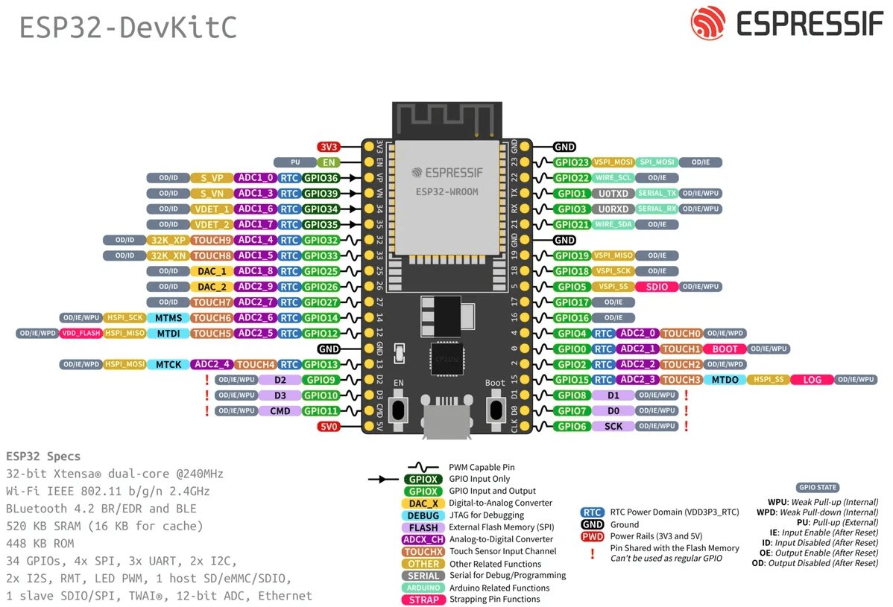
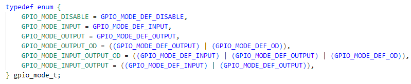
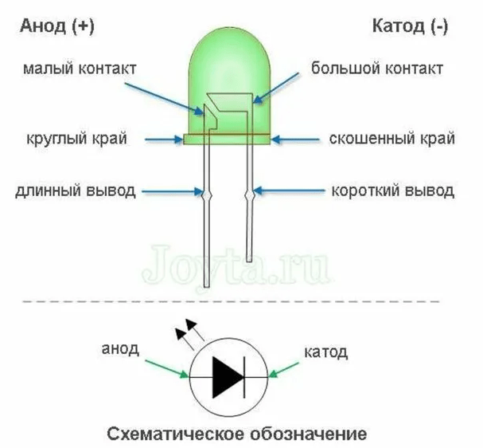

# Работа с портами ввода-вывода GPIO из ESP-IDF


Добрый день, уважаемый читатель! В этой статье обсудим методы работы со встроенными портами ввода-вывода GPIO в _цифровом_ режиме.

## Какие выводы GPIO можно использовать для ввод и вывод

Давайте вспомним, какие выводы можно использовать на ESP32 (я буду рассматривать линейки _ESP32-WROOM_ или _ESP32-WROVER_).

Чип ESP32 имеет 34 физических контакта GPIO. Каждая контактная площадка может использоваться как вход/выход общего назначения (_GPIO_) или может быть подключена к внутреннему периферийному сигналу. Мультиплексоры IO\_MUX, RTC IO\_MUX и матрица GPIO отвечают за маршрутизацию сигналов от периферийных устройств к контактам GPIO. Вместе эти системы обеспечивают гибко настраиваемый ввод-вывод.

[](1.3.4/esp32-devkitc-pins.png) Порты ввода-вывода для ESP32-DevKitC V4

*   **На ввод и вывод**_для ESP32-WROOM_ можно смело использовать следующие 18 выводов GPIO: **4, 14, 16, 17, 18, 19, 21, 22, 23, 25, 26, 27, 32, 33**. Все указанные выводы**имеют встроенные программно-подключаемые резисторы подтяжки 45 кОм**(_в документации это называется “слабая подтяжка”_). Я буду называть эти порты “универсальными”, для простоты понимания. Некоторые из них можно назначить для использования различных интерфейсов: I2C, SPI и т.д._Примечания: для ESP32-WROVER выводы 16 и 17 использовать нельзя_.
*   Выводы**GPIO 34, 35, 36, 39**можно использовать**только на ввод**, и у них отсутствуют встроенные резисторы слабой подтяжки. На эти же выводы выведен канал ADC1.
*   Можно ещё использовать **GPIO\*\*\*\*0, 2, 5, 12, 15**, но с учетом того, что их нельзя подтягивать ни к питанию, ни к земле при старте микроконтроллера.

На все эти выводы можно подключить обработчики прерываний для отслеживания изменения уровня извне микроконтроллера, но прерывания обсудим в следующей статье.

Хочу обратить ваше внимание только на то, что,[согласно спецификации](https://www.espressif.com/sites/default/files/documentation/esp32_datasheet_en.pdf), выводы GPIO допускают ток аж до 40 mA “высокого” уровня и до 28 mA “низкого” уровня. Это позволяет управлять различными слаботочными устройствами типа светодиодов напрямую, без применения коммутирующих транзисторов, нужно только учитывать напряжение на выводе не более 3.3В.

> Более подробно об выводах микроконтроллера ESP32 вы можете прочитать [в отдельной статье](esp32pinout.md). Там же можно скачать достаточно удобную excel-таблицу для распределения выводов в своем проекте с учетом их особенностей. Если вам не хватает свободных GPIO, вы можете воспользоваться I2C расширителями GPIO, например [PCF8574](pcf8574.md) или [MCP23017](mcp23017.md).

## Настройка порта GPIO

Для работы с портами GPIO необходимо подключить модуль “driver/gpio.h”:

`# include "driver/gpio.h"`

Как и в Arduino IDE, прежде чем начинать работу с GPIO, его нужно настроить (сконфигурировать). Каждый “универсальный” порт можно настроить:

*   **направление**: на вход или выход
*   **слабая подтяжка**(45 КОм) к +3,3В или к “земле”
*   **прерывание**(если необходимо)

ESP-IDF предлагает два метода конфигурации:

*   Пакетная конфигурация сразу нескольких портов: с помощью функции[**gpio\_config (**](https://docs.espressif.com/projects/esp-idf/en/stable/esp32/api-reference/peripherals/gpio.html#_CPPv411gpio_configPK13gpio_config_t)[_**const**_](https://docs.espressif.com/projects/esp-idf/en/stable/esp32/api-reference/peripherals/gpio.html#_CPPv411gpio_configPK13gpio_config_t)[__gpio\_config\_t_ pGPIOConfig)_\*](https://docs.espressif.com/projects/esp-idf/en/stable/esp32/api-reference/peripherals/gpio.html#_CPPv411gpio_configPK13gpio_config_t). Эта функция позволяет за один вызов настроить все параметры для нескольких выбранных портов: направление, подтяжки, прерывания. Соответственно это чуть более быстрый способ.
*   С помощью набора функций[**gpio\_set\_direction**](https://docs.espressif.com/projects/esp-idf/en/stable/esp32/api-reference/peripherals/gpio.html#_CPPv418gpio_set_direction10gpio_num_t11gpio_mode_t)**,**[**gpio\_set\_pull\_mode**](https://docs.espressif.com/projects/esp-idf/en/stable/esp32/api-reference/peripherals/gpio.html#_CPPv418gpio_set_pull_mode10gpio_num_t16gpio_pull_mode_t), и т.д. Это более “детализированные” функции и работают они только для одного выбранного порта. Я чаще использую именно этот способ, скорее всего “по привычке” (так как они более похожи на способ из Arduino IDE).

### Выбор вывода для работы в режиме**GPIO**

Прежде всего необходимо**настроить GPIO для использования в режиме ввода-вывода**(так как GPIO на ESP32 могут быть использованы для разных целей с помощью мультиплексора выводов IO\_MUX). Разработчики ESP32 не гарантируют, что после аппаратного сброса микроконтроллера все его выводы установятся в режим ввода-вывода. Поэтому операцию перевода нужных выводов в режим GPIO желательно делать всегда.

Сделать это можно с помощью функции:

[esp\_err\_t**gpio\_reset\_pin**(_gpio\_num\_t_**gpio\_num**](https://docs.espressif.com/projects/esp-idf/en/stable/esp32/api-reference/peripherals/gpio.html#_CPPv414gpio_reset_pin10gpio_num_t)[)](https://docs.espressif.com/projects/esp-idf/en/stable/esp32/api-reference/peripherals/gpio.html#_CPPv414gpio_reset_pin10gpio_num_t)

где:

*   **gpio\_num**– номер вывода GPIO

Эта функция настраивает IOMUX для этого вывода на работу с GPIO, включает встроенную слабую подтяжку и отключает режимы работы на вход и на выход (_то есть устанавливается режим GPIO\_MODE\_DISABLE – см. следующий раздел_).

_Для этой же цели можно воспользоваться другой функцией (**начиная с версии ESP-IDF 5.0 она считается устаревшей** – прим.авт.)_, которая просто перенастраивает IOMUX для этого вывода на работу с GPIO:

[void**gpio\_pad\_select\_gpio**(_uint8\_t_**gpio\_num**)](https://github.com/espressif/esp-idf/blob/master/components/esp_rom/include/esp32/rom/gpio.h#L229-L236)

где:

*   **gpio\_num**– номер вывода GPIO

_Примечание: функция [**gpio\_pad\_select\_gpio**](https://github.com/espressif/esp-idf/blob/master/components/esp_rom/include/esp32/rom/gpio.h#L229-L236) является устаревшей и в ESP-IDF 5.x не доступна._

### **Режимы работы портов ввода-вывода**

ESP32 поддерживает несколько режимов GPIO:

[](1.3.4/esp32-gpio01.png)

*   **GPIO\_MODE\_DISABLE**– порт**отключён**
*   **GPIO\_MODE\_INPUT**– порт работает**только на вход**
*   **GPIO\_MODE\_OUTPUT**– порт работает**только на выход**
*   **GPIO\_MODE\_OUTPUT\_OD**– порт работает**только на выход в режиме “открытый сток”**(open-drain)
*   **GPIO\_MODE\_INPUT\_OUTPUT\_OD**– порт может работать одновременно**и на вход и на выход с открытым стоком**
*   **GPIO\_MODE\_INPUT\_OUTPUT**– порт может работать одновременно**и на вход и на выход**

В режимах с открытым коллектором (OD) микроконтроллер управляет только низким логическим уровнем, при установке на GPIO логической единицы вывод отключается и остается “болтаться в воздухе”. Этот режим удобно использовать для датчиков типа DHT11-22 или для управления светодиодами “по низкому уровню” (катодом к выводу, анодом к +3,3В).

Для выбора режима порта используйте функцию

[_esp\_err\_t_](https://docs.espressif.com/projects/esp-idf/en/stable/esp32/api-reference/peripherals/gpio.html#_CPPv418gpio_set_direction10gpio_num_t11gpio_mode_t)[**gpio\_set\_direction(**](https://docs.espressif.com/projects/esp-idf/en/stable/esp32/api-reference/peripherals/gpio.html#_CPPv418gpio_set_direction10gpio_num_t11gpio_mode_t)[_gpio\_num\_t_](https://docs.espressif.com/projects/esp-idf/en/stable/esp32/api-reference/peripherals/gpio.html#_CPPv418gpio_set_direction10gpio_num_t11gpio_mode_t)[**gpio\_num,**](https://docs.espressif.com/projects/esp-idf/en/stable/esp32/api-reference/peripherals/gpio.html#_CPPv418gpio_set_direction10gpio_num_t11gpio_mode_t)[_gpio\_mode\_t_](https://docs.espressif.com/projects/esp-idf/en/stable/esp32/api-reference/peripherals/gpio.html#_CPPv418gpio_set_direction10gpio_num_t11gpio_mode_t)[**mode)**](https://docs.espressif.com/projects/esp-idf/en/stable/esp32/api-reference/peripherals/gpio.html#_CPPv418gpio_set_direction10gpio_num_t11gpio_mode_t)

где:

*   **gpio\_num**– идентификатор GPIO
*   **mode**– режим работы

Переключить режим работы порта можно в любой момент, не обязательно делать это только при старте прошивки.

### **Встроенная подтяжка**

Большинство портов имеют встроенные резисторы слабой подтяжки. Чтобы их задействовать, существует несколько функций.

_Универсальная функция_:

[_esp\_err\_t_](https://docs.espressif.com/projects/esp-idf/en/stable/esp32/api-reference/peripherals/gpio.html#_CPPv418gpio_set_pull_mode10gpio_num_t16gpio_pull_mode_t)[**gpio\_set\_pull\_mode(**](https://docs.espressif.com/projects/esp-idf/en/stable/esp32/api-reference/peripherals/gpio.html#_CPPv418gpio_set_pull_mode10gpio_num_t16gpio_pull_mode_t)[_gpio\_num\_t_](https://docs.espressif.com/projects/esp-idf/en/stable/esp32/api-reference/peripherals/gpio.html#_CPPv418gpio_set_pull_mode10gpio_num_t16gpio_pull_mode_t)[**gpio\_num,**](https://docs.espressif.com/projects/esp-idf/en/stable/esp32/api-reference/peripherals/gpio.html#_CPPv418gpio_set_pull_mode10gpio_num_t16gpio_pull_mode_t)[_gpio\_pull\_mode\_t_](https://docs.espressif.com/projects/esp-idf/en/stable/esp32/api-reference/peripherals/gpio.html#_CPPv418gpio_set_pull_mode10gpio_num_t16gpio_pull_mode_t)[**pull)**](https://docs.espressif.com/projects/esp-idf/en/stable/esp32/api-reference/peripherals/gpio.html#_CPPv418gpio_set_pull_mode10gpio_num_t16gpio_pull_mode_t)

где:

*   **gpio\_num**– идентификатор GPIO
*   **pull**– режим подтяжки

Режим**gpio\_pull\_mode\_t**может принимать одно из нескольких значений:

*   **GPIO\_PULLUP\_ONLY**– подтяжка**к питанию**+3,3В
*   **GPIO\_PULLDOWN\_ONLY**– подтяжка**к “земле”**
*   **GPIO\_PULLUP\_PULLDOWN**– подтяжка**одновременно к питанию +3,3В и “земле”**
*   **GPIO\_FLOATING**– подтяжка**отключена**

_Однако можно использовать и несколько более простых функций_:

*   [_esp\_err\_t_](https://docs.espressif.com/projects/esp-idf/en/stable/esp32/api-reference/peripherals/gpio.html#_CPPv414gpio_pullup_en10gpio_num_t)[](https://docs.espressif.com/projects/esp-idf/en/stable/esp32/api-reference/peripherals/gpio.html#_CPPv414gpio_pullup_en10gpio_num_t)[**gpio\_pullup\_en**](https://docs.espressif.com/projects/esp-idf/en/stable/esp32/api-reference/peripherals/gpio.html#_CPPv414gpio_pullup_en10gpio_num_t)[(](https://docs.espressif.com/projects/esp-idf/en/stable/esp32/api-reference/peripherals/gpio.html#_CPPv414gpio_pullup_en10gpio_num_t)[_gpio\_num\_t_](https://docs.espressif.com/projects/esp-idf/en/stable/esp32/api-reference/peripherals/gpio.html#_CPPv414gpio_pullup_en10gpio_num_t)[](https://docs.espressif.com/projects/esp-idf/en/stable/esp32/api-reference/peripherals/gpio.html#_CPPv414gpio_pullup_en10gpio_num_t)[**gpio\_num**](https://docs.espressif.com/projects/esp-idf/en/stable/esp32/api-reference/peripherals/gpio.html#_CPPv414gpio_pullup_en10gpio_num_t)[)](https://docs.espressif.com/projects/esp-idf/en/stable/esp32/api-reference/peripherals/gpio.html#_CPPv414gpio_pullup_en10gpio_num_t)– включить подтяжку к питанию +3,3В
*   [_esp\_err\_t_](https://docs.espressif.com/projects/esp-idf/en/stable/esp32/api-reference/peripherals/gpio.html#_CPPv415gpio_pullup_dis10gpio_num_t)[](https://docs.espressif.com/projects/esp-idf/en/stable/esp32/api-reference/peripherals/gpio.html#_CPPv415gpio_pullup_dis10gpio_num_t)[**gpio\_pullup\_dis**](https://docs.espressif.com/projects/esp-idf/en/stable/esp32/api-reference/peripherals/gpio.html#_CPPv415gpio_pullup_dis10gpio_num_t)[(](https://docs.espressif.com/projects/esp-idf/en/stable/esp32/api-reference/peripherals/gpio.html#_CPPv415gpio_pullup_dis10gpio_num_t)[_gpio\_num\_t_](https://docs.espressif.com/projects/esp-idf/en/stable/esp32/api-reference/peripherals/gpio.html#_CPPv415gpio_pullup_dis10gpio_num_t)[](https://docs.espressif.com/projects/esp-idf/en/stable/esp32/api-reference/peripherals/gpio.html#_CPPv415gpio_pullup_dis10gpio_num_t)[**gpio\_num**](https://docs.espressif.com/projects/esp-idf/en/stable/esp32/api-reference/peripherals/gpio.html#_CPPv415gpio_pullup_dis10gpio_num_t)[)](https://docs.espressif.com/projects/esp-idf/en/stable/esp32/api-reference/peripherals/gpio.html#_CPPv415gpio_pullup_dis10gpio_num_t)– отключить подтяжку к питанию +3,3В
*   [_esp\_err\_t_](https://docs.espressif.com/projects/esp-idf/en/stable/esp32/api-reference/peripherals/gpio.html#_CPPv416gpio_pulldown_en10gpio_num_t)[](https://docs.espressif.com/projects/esp-idf/en/stable/esp32/api-reference/peripherals/gpio.html#_CPPv416gpio_pulldown_en10gpio_num_t)[**gpio\_pulldown\_en**](https://docs.espressif.com/projects/esp-idf/en/stable/esp32/api-reference/peripherals/gpio.html#_CPPv416gpio_pulldown_en10gpio_num_t)[(](https://docs.espressif.com/projects/esp-idf/en/stable/esp32/api-reference/peripherals/gpio.html#_CPPv416gpio_pulldown_en10gpio_num_t)[_gpio\_num\_t_](https://docs.espressif.com/projects/esp-idf/en/stable/esp32/api-reference/peripherals/gpio.html#_CPPv416gpio_pulldown_en10gpio_num_t)[](https://docs.espressif.com/projects/esp-idf/en/stable/esp32/api-reference/peripherals/gpio.html#_CPPv416gpio_pulldown_en10gpio_num_t)[**gpio\_num**](https://docs.espressif.com/projects/esp-idf/en/stable/esp32/api-reference/peripherals/gpio.html#_CPPv416gpio_pulldown_en10gpio_num_t)[)](https://docs.espressif.com/projects/esp-idf/en/stable/esp32/api-reference/peripherals/gpio.html#_CPPv416gpio_pulldown_en10gpio_num_t)– включить подтяжку к “земле”
*   [_esp\_err\_t_](https://docs.espressif.com/projects/esp-idf/en/stable/esp32/api-reference/peripherals/gpio.html#_CPPv417gpio_pulldown_dis10gpio_num_t)[](https://docs.espressif.com/projects/esp-idf/en/stable/esp32/api-reference/peripherals/gpio.html#_CPPv417gpio_pulldown_dis10gpio_num_t)[**gpio\_pulldown\_dis**](https://docs.espressif.com/projects/esp-idf/en/stable/esp32/api-reference/peripherals/gpio.html#_CPPv417gpio_pulldown_dis10gpio_num_t)[(](https://docs.espressif.com/projects/esp-idf/en/stable/esp32/api-reference/peripherals/gpio.html#_CPPv417gpio_pulldown_dis10gpio_num_t)[_gpio\_num\_t_](https://docs.espressif.com/projects/esp-idf/en/stable/esp32/api-reference/peripherals/gpio.html#_CPPv417gpio_pulldown_dis10gpio_num_t)[](https://docs.espressif.com/projects/esp-idf/en/stable/esp32/api-reference/peripherals/gpio.html#_CPPv417gpio_pulldown_dis10gpio_num_t)[**gpio\_num**](https://docs.espressif.com/projects/esp-idf/en/stable/esp32/api-reference/peripherals/gpio.html#_CPPv417gpio_pulldown_dis10gpio_num_t)[)](https://docs.espressif.com/projects/esp-idf/en/stable/esp32/api-reference/peripherals/gpio.html#_CPPv417gpio_pulldown_dis10gpio_num_t)– отключить подтяжку к “земле”

Какой метод использовать – выбирайте на свой вкус.

### Настройка допустимого выходного тока

Для GPIO, работающих на выход, ESP32 позволяет задать максимальный ток через выход. Это может быть полезно в некоторых случаях, например можно ограничить ток через светодиод без использования резистора. Для этого воспользуйтесь функцией:

[_esp\_err\_t_](https://docs.espressif.com/projects/esp-idf/en/stable/esp32/api-reference/peripherals/gpio.html#_CPPv425gpio_set_drive_capability10gpio_num_t16gpio_drive_cap_t)[](https://docs.espressif.com/projects/esp-idf/en/stable/esp32/api-reference/peripherals/gpio.html#_CPPv425gpio_set_drive_capability10gpio_num_t16gpio_drive_cap_t)[**gpio\_set\_drive\_capability (**](https://docs.espressif.com/projects/esp-idf/en/stable/esp32/api-reference/peripherals/gpio.html#_CPPv425gpio_set_drive_capability10gpio_num_t16gpio_drive_cap_t)[_gpio\_num\_t_](https://docs.espressif.com/projects/esp-idf/en/stable/esp32/api-reference/peripherals/gpio.html#_CPPv425gpio_set_drive_capability10gpio_num_t16gpio_drive_cap_t)[**gpio\_num ,**](https://docs.espressif.com/projects/esp-idf/en/stable/esp32/api-reference/peripherals/gpio.html#_CPPv425gpio_set_drive_capability10gpio_num_t16gpio_drive_cap_t)[_gpio\_drive\_cap\_t_](https://docs.espressif.com/projects/esp-idf/en/stable/esp32/api-reference/peripherals/gpio.html#_CPPv425gpio_set_drive_capability10gpio_num_t16gpio_drive_cap_t)[**strength)**](https://docs.espressif.com/projects/esp-idf/en/stable/esp32/api-reference/peripherals/gpio.html#_CPPv425gpio_set_drive_capability10gpio_num_t16gpio_drive_cap_t)

где:

*   **gpio\_num**– идентификатор GPIO
*   **strength**– максимально допустимый ток

Режим**gpio\_drive\_cap\_t**может принимать одно из нескольких значений:

*   **GPIO\_DRIVE\_CAP\_0**– слабый,**до ~5мА**
*   **GPIO\_DRIVE\_CAP\_1**– сильнее,**до ~10мА**
*   **GPIO\_DRIVE\_CAP\_2**– средний (**по умолчанию**),**до ~20мА**
*   **GPIO\_DRIVE\_CAP\_3**– максимальный,**до ~40мА**

Как видите,**по умолчанию ток высокого уровня ограничен на уровне 20мА**. В большинстве случаев вызывать данную функцию при настройке порта не требуется. Но если ваше устройство на ESP32 требует большего тока (например при управлении мощным биполярным транзистором), то вы можете столкнуться с “неправильным” поведением. Как это работает на практике, вы [можете узнать из небольшого следственного эксперимента](https://kotyara12.ru/iot/esp32_gpio_capability/).

## Запись логического уровня в GPIO

Для записи данных в выходной порт необходимо воспользоваться функцией:

[_esp\_err\_t_](https://docs.espressif.com/projects/esp-idf/en/stable/esp32/api-reference/peripherals/gpio.html#_CPPv414gpio_set_level10gpio_num_t8uint32_t)[**gpio\_set\_level(**](https://docs.espressif.com/projects/esp-idf/en/stable/esp32/api-reference/peripherals/gpio.html#_CPPv414gpio_set_level10gpio_num_t8uint32_t)[_gpio\_num\_t_](https://docs.espressif.com/projects/esp-idf/en/stable/esp32/api-reference/peripherals/gpio.html#_CPPv414gpio_set_level10gpio_num_t8uint32_t)[**gpio\_num,**](https://docs.espressif.com/projects/esp-idf/en/stable/esp32/api-reference/peripherals/gpio.html#_CPPv414gpio_set_level10gpio_num_t8uint32_t)[_uint32\_t_](https://docs.espressif.com/projects/esp-idf/en/stable/esp32/api-reference/peripherals/gpio.html#_CPPv414gpio_set_level10gpio_num_t8uint32_t)[**level)**](https://docs.espressif.com/projects/esp-idf/en/stable/esp32/api-reference/peripherals/gpio.html#_CPPv414gpio_set_level10gpio_num_t8uint32_t)

где:

*   **gpio\_num**– идентификатор GPIO
*   **level**– логический уровень, 0 (низкий) или 1 (высокий)

Ничего сложного, всё предельно просто.

## Чтение логического уровня из GPIO

Для чтения данных из порта необходимо воспользоваться другой функцией:

[_uint32\_t_](https://docs.espressif.com/projects/esp-idf/en/stable/esp32/api-reference/peripherals/gpio.html#_CPPv414gpio_get_level10gpio_num_t)[**gpio\_get\_level(**](https://docs.espressif.com/projects/esp-idf/en/stable/esp32/api-reference/peripherals/gpio.html#_CPPv414gpio_get_level10gpio_num_t)[_gpio\_num\_t_](https://docs.espressif.com/projects/esp-idf/en/stable/esp32/api-reference/peripherals/gpio.html#_CPPv414gpio_get_level10gpio_num_t)[**gpio\_num)**](https://docs.espressif.com/projects/esp-idf/en/stable/esp32/api-reference/peripherals/gpio.html#_CPPv414gpio_get_level10gpio_num_t)

где:

*   **gpio\_num**– идентификатор GPIO

Если GPIO не настроен для ввода (или ввода и вывода), возвращаемое значение всегда равно 0.

## Практическое использование GPIO в режиме вывода – мигаем светодиодом

Допустим, мы хотим использовать светодиод, подключенный к одному из выводов через токоограничительный резистор, например это GPIO12. Классика жанра.

[](1.3.4/esp32-gpio02.png) Источник: Яндекс Картинки

Светодиод можно подключить двумя способами:

*   **С управлением по высокому уровню**. Анод через резистор к GPIO, катод – к общему проводу. В этом случае следует использовать режим _GPIO\_MODE\_OUTPUT_.
*   **С управлением по низкому уровню**. Анод к +3,3В, катод через резистор к GPIO. В этом случае лучше использовать режим _GPIO\_MODE\_OUTPUT\_OD_.

Для ESP32 наверное оптимальнее использовать первый способ, так как ток GPIO для высокого уровня может достигать до 40мА, а для низкого – только 28мА. Хотя для светодиода вполне достаточно 5~10мА, в крайнем случае – 20мА (для старых советских светодиодов зеленого цвета).

Настройка вывода будет выглядеть так:

```
    // Переключаем вывод GPIO_NUM_12 в режим GPIO
    gpio_reset_pin(GPIO_NUM_12);
    // Настраиваем вывод GPIO_NUM_12 на выход без подтяжки
    gpio_set_direction(GPIO_NUM_12, GPIO_MODE_OUTPUT);
    gpio_set_pull_mode(GPIO_NUM_12, GPIO_FLOATING);
```
Для мигания светодиодов создадим задачу. Цикл задачи для мигания светодиодом в простейшем случае может выглядеть примерно так:

```

// Мигание светодиодом

while(1){

    // Устанавливаем высокий уровень

    gpio\_set\_level(GPIO\_NUM\_12, 1);

    // Пауза 500 секунд

    vTaskDelay(pdMS\_TO\_TICKS(500));

    // Устанавливаем низкий уровень

    gpio\_set\_level(GPIO\_NUM\_12, 0);

    // Пауза 500 секунд

    vTaskDelay(pdMS\_TO\_TICKS(500));

};
```

## **Использование GPIO для пробуждения микроконтроллера**

Если вы используете в своих разработках режим глубокого сна (например при питании от батарей), то вы можете использовать вывод GPIO для пробуждения микроконтроллера по внешнему сигналу. Задействовать данную функцию можно с помощью функции:

[_esp\_err\_t_](https://docs.espressif.com/projects/esp-idf/en/stable/esp32/api-reference/peripherals/gpio.html#_CPPv418gpio_wakeup_enable10gpio_num_t15gpio_int_type_t)[](https://docs.espressif.com/projects/esp-idf/en/stable/esp32/api-reference/peripherals/gpio.html#_CPPv418gpio_wakeup_enable10gpio_num_t15gpio_int_type_t)[**gpio\_wakeup\_enable (**](https://docs.espressif.com/projects/esp-idf/en/stable/esp32/api-reference/peripherals/gpio.html#_CPPv418gpio_wakeup_enable10gpio_num_t15gpio_int_type_t)[_gpio\_num\_t_](https://docs.espressif.com/projects/esp-idf/en/stable/esp32/api-reference/peripherals/gpio.html#_CPPv418gpio_wakeup_enable10gpio_num_t15gpio_int_type_t)[**gpio\_num,**](https://docs.espressif.com/projects/esp-idf/en/stable/esp32/api-reference/peripherals/gpio.html#_CPPv418gpio_wakeup_enable10gpio_num_t15gpio_int_type_t)[_gpio\_int\_type\_t_](https://docs.espressif.com/projects/esp-idf/en/stable/esp32/api-reference/peripherals/gpio.html#_CPPv418gpio_wakeup_enable10gpio_num_t15gpio_int_type_t)[**intr\_type)**](https://docs.espressif.com/projects/esp-idf/en/stable/esp32/api-reference/peripherals/gpio.html#_CPPv418gpio_wakeup_enable10gpio_num_t15gpio_int_type_t)

где:

*   **gpio\_num**– идентификатор GPIO
*   **intr\_type**– логический уровень на GPIO для пробуждения. Можно использовать только GPIO\_INTR\_LOW\_LEVEL или GPIO\_INTR\_HIGH\_LEVEL.

Отключить пробуждение можно с помощью функции**gpio\_wakeup\_disable (**[_gpio\_num\_t_](https://docs.espressif.com/projects/esp-idf/en/stable/esp32/api-reference/peripherals/gpio.html#_CPPv410gpio_num_t)**gpio\_num)**.

_Ну вот и всё, о чем я хотел рассказать в данной статье. Пример [вы можете посмотреть на GitHub](https://github.com/kotyara12/dzen/tree/master/gpio)._

## Прерывания по изменению уровня на GPIO

\*\*[_Прерывания по изменению уровня на GPIO мы обсудим в следующей статье, так как это отдельная большая тема._](esp32_gpio_isr)\*\*А еще в одной статье вы можете познакомиться с [обработкой нажатия кнопок на ESP32 по прерыванию и борьбой с дребезгом контактов](esp32-buttons).

### **Полезные ссылки**

1.  [ESP-IDF — GPIO and RTC GPIO.](https://docs.espressif.com/projects/esp-idf/en/stable/esp32/api-reference/peripherals/gpio.html#gpio-rtc-gpio)
2.  [Пример на GitHub](https://github.com/kotyara12/dzen/tree/master/gpio)
